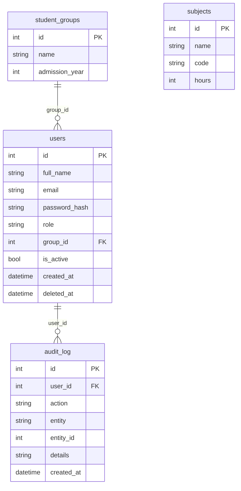

# Техническое задание: Backend модуля «Админ-панель» (Admin Panel)

## 1. Назначение модуля

Админ-панель — служебный модуль College Management System, через который администратор колледжа управляет системой: заводит и блокирует учётные записи, ведёт справочники (учебные группы и дисциплины), которыми пользуются остальные модули (журнал, расписание, рабочие программы, отчёты, кабинеты студента и преподавателя), смотрит журнал действий и общую статистику.

Backend модуля предоставляет REST API для всех этих операций. Доступ к API есть только у пользователей с ролью `admin`.

## 2. Функциональные требования

### 2.1. Основные функции

- **Управление пользователями:** просмотр списка (с поиском, фильтрами и пагинацией), просмотр карточки, создание, редактирование, блокировка и разблокировка, сброс пароля, удаление (мягкое — запись остаётся в БД, но помечается удалённой).
- **Управление ролями:** назначение роли пользователю (`admin`, `teacher`, `student`) при создании и редактировании.
- **Управление учебными группами:** просмотр, создание, редактирование, удаление; привязка студентов к группе.
- **Управление дисциплинами:** просмотр, создание, редактирование, удаление.
- **Журнал действий (audit log):** автоматическая запись всех изменяющих действий администратора и просмотр журнала с фильтрами.
- **Статистика для главной страницы:** количество пользователей по ролям, заблокированных учётных записей, групп и дисциплин.

### 2.2. Пользовательские сценарии

**Сценарий 1: Создание учётной записи студента**

1. Администратор открывает форму создания пользователя и вводит ФИО, email, пароль, роль `student`, выбирает группу.
2. Backend проверяет данные (обязательные поля, формат email, уникальность email, существование группы), хэширует пароль средствами `core/`.
3. В таблицу `users` добавляется запись, в `audit_log` — запись о действии `user.create`. Клиент получает созданного пользователя без поля пароля.

**Сценарий 2: Блокировка пользователя**

1. Администратор открывает список пользователей, находит нужного по поиску и нажимает «Заблокировать».
2. Backend выставляет `is_active = false` и записывает действие `user.block` в журнал.
3. Заблокированный пользователь больше не может войти в систему; его данные в других модулях сохраняются.

**Сценарий 3: Создание группы и перевод студентов**

1. Администратор создаёт группу (название, год набора).
2. Затем редактирует карточки студентов и указывает им новую `group_id`.
3. Остальные модули (расписание, журнал) при следующем запросе видят актуальный состав группы.

**Сценарий 4: Просмотр журнала действий**

1. Администратор открывает журнал и задаёт фильтры (пользователь, тип действия, период).
2. Backend возвращает страницу записей, отсортированных от новых к старым.

## 3. Нефункциональные требования

- **Производительность:** ответ на запрос списка (до 1000 записей в таблице, страница до 100 элементов) — не более 1 секунды в локальном окружении. Все списки отдаются с пагинацией.
- **Безопасность:** все эндпоинты требуют авторизации и роли `admin` (иначе `401` / `403`). Пароли хранятся только в виде хэша и никогда не возвращаются в ответах. Входные данные валидируются (Pydantic). Каждое изменяющее действие попадает в журнал.
- **Совместимость:** модуль использует общие компоненты `core/` — конфигурацию, подключение к БД, модели данных и аутентификацию — и не дублирует их. Структура кода повторяет `docs/examples/example_module/`. Код соответствует PEP 8 (`flake8`), тесты запускаются через `pytest`.
- **Формат данных:** JSON, кодировка UTF-8, даты и время — ISO 8601 (`2026-09-18T10:00:00`).
## 4. Интерфейсы

### 4.1. API Endpoints

Раздел согласуется с frontend-командой модуля (issue #25) по чек-листу из «API-контракт» до начала Модуля 2.

**Общие правила контракта**

- Все пути начинаются с `/api/v1/admin_panel`.
- Авторизация: заголовок `Authorization: Bearer <token>`, выдаваемый механизмом аутентификации из `core/`. Нужна роль `admin`.
- Тело ошибки (кроме `422`): `{"detail": "Текст ошибки"}`. Ошибка `422` приходит в стандартном формате FastAPI.
- Списки отдаются объектом: `{"items": [...], "total": 42, "page": 1, "page_size": 20}`. Query-параметры пагинации: `page` (по умолчанию 1), `page_size` (по умолчанию 20, максимум 100).
- Общие ошибки для всех эндпоинтов: `401` — нет или недействителен токен, `403` — роль не `admin`.

**Сводная таблица**

| Метод  | Endpoint                                  | Описание                       | Успешный ответ | Ошибки             |
| ------ | ----------------------------------------- | ------------------------------ | -------------- | ------------------ |
| GET    | `/api/v1/admin_panel/users`               | Список пользователей           | 200            | 422                |
| GET    | `/api/v1/admin_panel/users/{user_id}`     | Один пользователь              | 200            | 404                |
| POST   | `/api/v1/admin_panel/users`               | Создать пользователя           | 201            | 409, 422           |
| PATCH  | `/api/v1/admin_panel/users/{user_id}`     | Изменить пользователя          | 200            | 404, 409, 422      |
| DELETE | `/api/v1/admin_panel/users/{user_id}`     | Удалить пользователя (мягко)   | 204            | 404, 409           |
| POST   | `/api/v1/admin_panel/users/{user_id}/reset-password` | Сбросить пароль     | 204            | 404, 422           |
| GET    | `/api/v1/admin_panel/groups`              | Список групп                   | 200            | 422                |
| GET    | `/api/v1/admin_panel/groups/{group_id}`   | Одна группа                    | 200            | 404                |
| POST   | `/api/v1/admin_panel/groups`              | Создать группу                 | 201            | 409, 422           |
| PATCH  | `/api/v1/admin_panel/groups/{group_id}`   | Изменить группу                | 200            | 404, 409, 422      |
| DELETE | `/api/v1/admin_panel/groups/{group_id}`   | Удалить группу                 | 204            | 404, 409           |
| GET    | `/api/v1/admin_panel/subjects`            | Список дисциплин               | 200            | 422                |
| GET    | `/api/v1/admin_panel/subjects/{subject_id}` | Одна дисциплина              | 200            | 404                |
| POST   | `/api/v1/admin_panel/subjects`            | Создать дисциплину             | 201            | 409, 422           |
| PATCH  | `/api/v1/admin_panel/subjects/{subject_id}` | Изменить дисциплину          | 200            | 404, 409, 422      |
| DELETE | `/api/v1/admin_panel/subjects/{subject_id}` | Удалить дисциплину           | 204            | 404                |
| GET    | `/api/v1/admin_panel/audit-log`           | Журнал действий                | 200            | 422                |
| GET    | `/api/v1/admin_panel/dashboard`           | Статистика системы             | 200            | —                  |

#### Пользователи

**Объект пользователя** (во всех ответах, пароль и его хэш не возвращаются):

```json
{
  "id": 5,
  "full_name": "Иванов Иван Иванович",
  "email": "ivanov@college.ru",
  "role": "student",
  "group_id": 2,
  "is_active": true,
  "created_at": "2026-09-18T10:00:00"
}
```

Для ролей `teacher` и `admin` поле `group_id` равно `null`.

##### `GET /api/v1/admin_panel/users`

**Назначение:** получить страницу списка пользователей.

**Query-параметры (все необязательные):**

| Параметр    | Тип    | Описание                                              |
| ----------- | ------ | ----------------------------------------------------- |
| `role`      | строка | Фильтр по роли: `admin`, `teacher`, `student`         |
| `group_id`  | число  | Фильтр по группе                                      |
| `is_active` | булево | `true` — только активные, `false` — только заблокированные |
| `search`    | строка | Поиск по ФИО и email (подстрока, без учёта регистра)  |
| `page`, `page_size` | число | Пагинация                                    |

**Успешный ответ — `200 OK`:**

```json
{
  "items": [
    {
      "id": 5,
      "full_name": "Иванов Иван Иванович",
      "email": "ivanov@college.ru",
      "role": "student",
      "group_id": 2,
      "is_active": true,
      "created_at": "2026-09-18T10:00:00"
    }
  ],
  "total": 1,
  "page": 1,
  "page_size": 20
}
```

**Ошибки:** `422` — некорректное значение параметра (например, `role=boss`).

##### `GET /api/v1/admin_panel/users/{user_id}`

**Параметры пути:** `user_id` (целое число).

**Успешный ответ — `200 OK`:** объект пользователя.

**Ошибка — `404 Not Found`:** `{"detail": "Пользователь не найден"}`

##### `POST /api/v1/admin_panel/users`

**Тело запроса:**

```json
{
  "full_name": "Иванов Иван Иванович",
  "email": "ivanov@college.ru",
  "password": "StrongPass123",
  "role": "student",
  "group_id": 2
}
```

| Поле        | Тип    | Обязательно | Описание                                          |
| ----------- | ------ | ----------- | ------------------------------------------------- |
| `full_name` | строка | да          | ФИО, 2–150 символов                               |
| `email`     | строка | да          | Корректный email, уникальный                      |
| `password`  | строка | да          | Не короче 8 символов                              |
| `role`      | строка | да          | `admin`, `teacher` или `student`                  |
| `group_id`  | число  | нет         | Только для роли `student`; группа должна существовать |

**Успешный ответ — `201 Created`:** объект созданного пользователя.

**Ошибки:**
- `409 Conflict` — email уже занят: `{"detail": "Пользователь с таким email уже существует"}`
- `422 Unprocessable Entity` — не прошла валидация (нет обязательного поля, слабый пароль, несуществующая группа и т. п.)

##### `PATCH /api/v1/admin_panel/users/{user_id}`

**Назначение:** частичное изменение пользователя; в том числе блокировка и разблокировка (`is_active`).

**Тело запроса** (передаются только изменяемые поля):

```json
{
  "full_name": "Иванов Иван Петрович",
  "role": "teacher",
  "group_id": null,
  "is_active": false
}
```

Допустимые поля: `full_name`, `email`, `role`, `group_id`, `is_active`.

**Успешный ответ — `200 OK`:** обновлённый объект пользователя.

**Ошибки:**
- `404` — пользователь не найден
- `409` — новый email занят; либо попытка заблокировать или разжаловать самого себя / последнего администратора: `{"detail": "Нельзя заблокировать последнего администратора"}`
- `422` — некорректные данные

##### `DELETE /api/v1/admin_panel/users/{user_id}`

**Назначение:** мягкое удаление (запись помечается `deleted_at`, из списков пропадает).

**Успешный ответ — `204 No Content`** (тела нет).

**Ошибки:** `404` — пользователь не найден; `409` — нельзя удалить самого себя или последнего администратора.

##### `POST /api/v1/admin_panel/users/{user_id}/reset-password`

**Тело запроса:** `{"new_password": "NewStrongPass456"}`

**Успешный ответ — `204 No Content`.**

**Ошибки:** `404` — пользователь не найден; `422` — пароль короче 8 символов.
#### Группы

**Объект группы:**

```json
{
  "id": 2,
  "name": "ИС-31",
  "admission_year": 2024,
  "students_count": 25
}
```

- `GET /groups` — query-параметры `search` (по названию), `page`, `page_size`; ответ `200` — список в формате `{"items": [...], "total": ..., "page": ..., "page_size": ...}`.
- `GET /groups/{group_id}` — `200` с объектом группы; `404` `{"detail": "Группа не найдена"}`.
- `POST /groups` — тело `{"name": "ИС-31", "admission_year": 2024}` (оба поля обязательны, `name` уникально, 1–50 символов; `admission_year` — от 2000 до 2100); ответ `201` с объектом группы; ошибки `409` (`{"detail": "Группа с таким названием уже существует"}`), `422`.
- `PATCH /groups/{group_id}` — тело с изменяемыми полями `name`, `admission_year`; ответ `200`; ошибки `404`, `409`, `422`.
- `DELETE /groups/{group_id}` — ответ `204`; ошибки `404`, `409` (`{"detail": "В группе есть студенты, сначала переведите их в другую группу"}`).

#### Дисциплины

**Объект дисциплины:**

```json
{
  "id": 7,
  "name": "Разработка программных модулей",
  "code": "МДК.01.01",
  "hours": 120
}
```

- `GET /subjects` — query-параметры `search` (по названию и коду), `page`, `page_size`; ответ `200` — список в общем формате.
- `GET /subjects/{subject_id}` — `200`; `404` `{"detail": "Дисциплина не найдена"}`.
- `POST /subjects` — тело `{"name": "...", "code": "...", "hours": 120}`: `name` и `code` обязательны (`code` уникален), `hours` — целое от 1, необязательно; ответ `201`; ошибки `409`, `422`.
- `PATCH /subjects/{subject_id}` — изменяемые поля `name`, `code`, `hours`; ответ `200`; ошибки `404`, `409`, `422`.
- `DELETE /subjects/{subject_id}` — ответ `204`; ошибка `404`.

#### Журнал действий

##### `GET /api/v1/admin_panel/audit-log`

**Query-параметры (все необязательные):** `user_id` (кто выполнил действие), `action` (например, `user.create`), `date_from`, `date_to` (даты в формате `YYYY-MM-DD`), `page`, `page_size`.

**Успешный ответ — `200 OK`:**

```json
{
  "items": [
    {
      "id": 101,
      "user_id": 1,
      "action": "user.block",
      "entity": "user",
      "entity_id": 5,
      "details": "is_active: true -> false",
      "created_at": "2026-09-18T10:15:00"
    }
  ],
  "total": 1,
  "page": 1,
  "page_size": 20
}
```

Записи отсортированы от новых к старым. Журнал только читается: через API его нельзя изменить или удалить.

**Ошибки:** `422` — некорректный формат даты или параметра.

#### Статистика

##### `GET /api/v1/admin_panel/dashboard`

**Параметры:** нет.

**Успешный ответ — `200 OK`:**

```json
{
  "users_total": 120,
  "users_by_role": {"admin": 2, "teacher": 18, "student": 100},
  "users_blocked": 3,
  "groups_total": 6,
  "subjects_total": 24
}
```

### 4.2. Взаимодействие с другими модулями

- **core/ (ядро):** подключение к БД и сессии, конфигурация, модели данных, аутентификация и проверка ролей, хэширование паролей. Админ-панель использует их и не дублирует.
- **Gradebook, Schedule, Curriculum:** читают справочники групп (`student_groups`) и дисциплин (`subjects`), которые ведутся в этом модуле. Структура таблиц фиксируется в разделе 5, чтобы другие команды могли на неё опираться.
- **Student Portal, Teacher Portal:** используют учётные записи и роли из таблицы `users`; блокировка пользователя в админ-панели должна запрещать ему вход.
- **Reports:** может использовать числовые показатели из `GET /dashboard` и данные групп.
- **Admin Panel — Frontend (issue #25):** потребитель всех эндпоинтов раздела 4.1.
## 5. Структура базы данных

### 5.1. Таблицы

Таблица `users` — основная таблица учётных записей, принадлежит `core/`. Модуль добавляет в неё, при необходимости, поля `group_id` и `deleted_at` (уточняется по реальной модели в `core/`).

**Таблица:** `users`

| Поле            | Тип      | Описание                                           |
| --------------- | -------- | -------------------------------------------------- |
| id              | Integer  | Первичный ключ                                     |
| full_name       | String   | ФИО                                                |
| email           | String   | Email, уникальный                                  |
| password_hash   | String   | Хэш пароля                                         |
| role            | String   | `admin`, `teacher`, `student`                      |
| group_id        | Integer  | Внешний ключ на `student_groups.id`, может быть NULL |
| is_active       | Boolean  | `false` — пользователь заблокирован                |
| created_at      | DateTime | Дата создания                                      |
| deleted_at      | DateTime | Дата мягкого удаления, NULL — запись действует     |

**Таблица:** `student_groups`

| Поле           | Тип     | Описание                       |
| -------------- | ------- | ------------------------------ |
| id             | Integer | Первичный ключ                 |
| name           | String  | Название группы, уникальное    |
| admission_year | Integer | Год набора                     |

**Таблица:** `subjects`

| Поле  | Тип     | Описание                       |
| ----- | ------- | ------------------------------ |
| id    | Integer | Первичный ключ                 |
| name  | String  | Название дисциплины            |
| code  | String  | Код дисциплины, уникальный     |
| hours | Integer | Количество часов, может быть NULL |

**Таблица:** `audit_log`

| Поле       | Тип      | Описание                                              |
| ---------- | -------- | ----------------------------------------------------- |
| id         | Integer  | Первичный ключ                                        |
| user_id    | Integer  | Внешний ключ на `users.id` — кто выполнил действие    |
| action     | String   | Код действия: `user.create`, `user.block`, `group.delete` и т. п. |
| entity     | String   | Тип объекта: `user`, `group`, `subject`               |
| entity_id  | Integer  | Идентификатор объекта                                 |
| details    | String   | Краткое описание изменения                            |
| created_at | DateTime | Время действия                                        |

## 6. Критерии приёмки

- [ ] Все функции из раздела 2.1 реализованы, эндпоинты из раздела 4.1 работают по описанному контракту
- [ ] Доступ ко всем эндпоинтам только у роли `admin`; без токена — `401`, с другой ролью — `403`
- [ ] Пароли хранятся в виде хэша и не возвращаются в ответах
- [ ] Каждое изменяющее действие записывается в `audit_log`
- [ ] Тесты написаны и проходят (`pytest`), покрыты основные успешные сценарии и ошибки (`404`, `409`, `422`, `401`, `403`)
- [ ] CI зелёный (`pytest` + `flake8`)
- [ ] Раздел 4.1 согласован с `specification-frontend.md` этого модуля (см. чек-лист в «API-контракт»)
- [ ] Pull Request создан и принят

## 7. Приложения

### Схема связей таблиц


