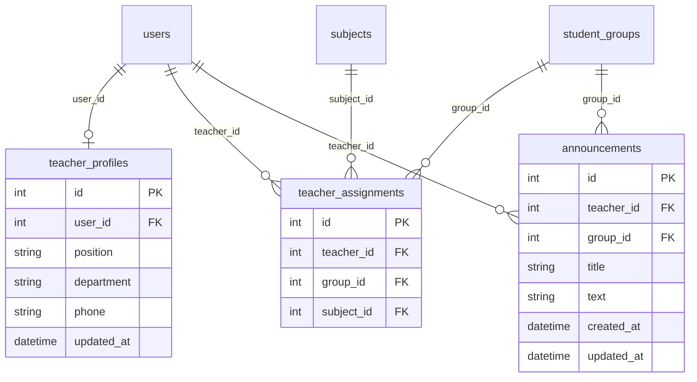

# Техническое задание: Backend модуля «Кабинет преподавателя» (Teacher Portal)

## 1. Назначение модуля

Кабинет преподавателя — модуль College Management System, который собирает в одном месте всё, что нужно преподавателю для ежедневной работы: его профиль, закреплённые за ним учебные группы и дисциплины, личное расписание и объявления для групп.

Backend модуля предоставляет REST API для этих операций. Доступ к API есть только у пользователей с ролью `teacher`, и каждый преподаватель видит только свои данные.

Модуль не дублирует функции других модулей: оценки и посещаемость ведутся в Gradebook, расписание формируется в Schedule, отчёты строятся в Reports. Кабинет преподавателя читает данные из этих модулей и показывает их в удобном для преподавателя виде.

## 2. Функциональные требования

### 2.1. Основные функции

- **Профиль преподавателя:** просмотр профиля, изменение контактных данных (телефон, должность, цикловая комиссия), смена пароля.
- **Мои группы и дисциплины:** список учебных групп, закреплённых за преподавателем, с перечнем дисциплин, которые он ведёт в каждой группе; карточка группы; список студентов группы.
- **Расписание преподавателя:** просмотр личного расписания занятий за выбранный период (по умолчанию — текущая неделя).
- **Объявления для групп:** создание, просмотр, редактирование и удаление объявлений, адресованных студентам закреплённой группы.
- **Сводка для главной страницы:** количество групп и студентов, число занятий на сегодня, ближайшее занятие, число опубликованных объявлений.

### 2.2. Пользовательские сценарии

**Сценарий 1: Просмотр своих групп и состава группы**

1. Преподаватель открывает раздел «Мои группы».
2. Backend определяет преподавателя по токену и возвращает группы, закреплённые за ним, вместе с дисциплинами и количеством студентов.
3. Преподаватель выбирает группу; backend проверяет, что группа закреплена за ним, и возвращает список студентов, отсортированный по ФИО.

**Сценарий 2: Публикация объявления для группы**

1. Преподаватель выбирает группу, вводит заголовок и текст объявления.
2. Backend проверяет данные и то, что группа закреплена за этим преподавателем.
3. В таблицу `announcements` добавляется запись. Студенты группы видят объявление в Student Portal.

**Сценарий 3: Просмотр расписания на неделю**

1. Преподаватель открывает раздел «Расписание» и при необходимости выбирает даты.
2. Backend читает занятия преподавателя из данных модуля Schedule за указанный период.
3. Клиент получает список занятий, отсортированный по дате и времени начала.

**Сценарий 4: Изменение контактных данных и смена пароля**

1. Преподаватель открывает профиль, меняет телефон и должность и сохраняет форму.
2. Backend валидирует данные и обновляет запись в `teacher_profiles`.
3. При смене пароля преподаватель вводит текущий и новый пароль; backend проверяет текущий пароль средствами `core/` и сохраняет хэш нового.

## 3. Нефункциональные требования

- **Производительность:** ответ на любой запрос — не более 1 секунды в локальном окружении. Период в запросе расписания — не более 31 дня. Список объявлений отдаётся с пагинацией.
- **Безопасность:** все эндпоинты требуют авторизации и роли `teacher` (иначе `401` / `403`). Преподаватель получает только данные закреплённых за ним групп и только собственные объявления. Пароли хранятся в виде хэша и не возвращаются в ответах. Входные данные валидируются (Pydantic). Текст объявлений хранится как обычный текст, экранирование при отображении выполняет frontend.
- **Совместимость:** модуль использует общие компоненты `core/` — конфигурацию, подключение к БД, модели данных, аутентификацию и проверку ролей — и не дублирует их. Структура кода повторяет `docs/examples/example_module/`. Код соответствует PEP 8 (`flake8`), тесты запускаются через `pytest`.
- **Формат данных:** JSON, кодировка UTF-8; дата — `YYYY-MM-DD`, время — `HH:MM`, дата и время — ISO 8601 (`2026-10-05T09:00:00`).

## 4. Интерфейсы

### 4.1. API Endpoints

Раздел согласуется с frontend-командой модуля (issue #24) по чек-листу из «API-контракт» до начала Модуля 2.

**Общие правила контракта**

- Все пути начинаются с `/api/v1/teacher_portal`.
- Авторизация: заголовок `Authorization: Bearer <token>`, выдаваемый механизмом аутентификации из `core/`. Нужна роль `teacher`.
- Тело ошибки (кроме `422`): `{"detail": "Текст ошибки"}`. Ошибка `422` приходит в стандартном формате FastAPI.
- Списки отдаются объектом с полями `items` (массив) и `total` (общее число записей). Если у списка есть пагинация, добавляются поля `page` и `page_size`.
- Общие ошибки для всех эндпоинтов: `401` — нет или недействителен токен, `403` — роль не `teacher`.

**Сводная таблица**

| Метод  | Endpoint                                           | Описание                                  | Успешный ответ | Ошибки             |
| ------ | -------------------------------------------------- | ----------------------------------------- | -------------- | ------------------ |
| GET    | `/api/v1/teacher_portal/profile`                   | Профиль текущего преподавателя            | 200            | 404                |
| PATCH  | `/api/v1/teacher_portal/profile`                   | Изменить контактные данные                | 200            | 422                |
| POST   | `/api/v1/teacher_portal/profile/change-password`   | Сменить пароль                            | 204            | 400, 422           |
| GET    | `/api/v1/teacher_portal/groups`                    | Группы преподавателя с дисциплинами       | 200            | —                  |
| GET    | `/api/v1/teacher_portal/groups/{group_id}`         | Карточка группы                           | 200            | 403, 404           |
| GET    | `/api/v1/teacher_portal/groups/{group_id}/students` | Список студентов группы                  | 200            | 403, 404           |
| GET    | `/api/v1/teacher_portal/schedule`                  | Расписание преподавателя за период        | 200            | 422                |
| GET    | `/api/v1/teacher_portal/announcements`             | Список своих объявлений                   | 200            | 403, 404, 422      |
| POST   | `/api/v1/teacher_portal/announcements`             | Создать объявление                        | 201            | 403, 404, 422      |
| PATCH  | `/api/v1/teacher_portal/announcements/{announcement_id}` | Изменить объявление                 | 200            | 404, 422           |
| DELETE | `/api/v1/teacher_portal/announcements/{announcement_id}` | Удалить объявление                  | 204            | 404                |
| GET    | `/api/v1/teacher_portal/dashboard`                 | Сводка для главной страницы               | 200            | —                  |

#### Профиль

**Объект профиля** (`id` — идентификатор пользователя-преподавателя):

```json
{
  "id": 12,
  "full_name": "Петрова Анна Сергеевна",
  "email": "petrova@college.ru",
  "position": "Преподаватель",
  "department": "Цикловая комиссия информационных технологий",
  "phone": "+7 900 123-45-67"
}
```

Поля `position`, `department` и `phone` необязательные и могут быть `null`. ФИО и email меняет только администратор (модуль Admin Panel).

##### `GET /api/v1/teacher_portal/profile`

**Параметры:** нет.

**Успешный ответ — `200 OK`:** объект профиля. Если профиль ещё не заполнен, поля `position`, `department`, `phone` равны `null`.

**Ошибка — `404 Not Found`:** учётная запись удалена: `{"detail": "Пользователь не найден"}`

##### `PATCH /api/v1/teacher_portal/profile`

**Тело запроса** (передаются только изменяемые поля):

```json
{
  "phone": "+7 900 123-45-67",
  "position": "Старший преподаватель",
  "department": "Цикловая комиссия информационных технологий"
}
```

| Поле         | Тип    | Описание                          |
| ------------ | ------ | --------------------------------- |
| `phone`      | строка | До 20 символов                    |
| `position`   | строка | До 100 символов                   |
| `department` | строка | До 150 символов                   |

**Успешный ответ — `200 OK`:** обновлённый объект профиля.

**Ошибка — `422 Unprocessable Entity`:** превышена длина поля или передано неизвестное поле (например, `email`).

##### `POST /api/v1/teacher_portal/profile/change-password`

**Тело запроса:**

```json
{
  "current_password": "OldPass123",
  "new_password": "NewStrongPass456"
}
```

**Успешный ответ — `204 No Content`** (тела нет).

**Ошибки:**
- `400 Bad Request` — неверный текущий пароль: `{"detail": "Неверный текущий пароль"}`
- `422 Unprocessable Entity` — новый пароль короче 8 символов или совпадает с текущим

#### Группы и студенты

**Объект группы:**

```json
{
  "id": 2,
  "name": "ИС-31",
  "admission_year": 2024,
  "students_count": 25,
  "subjects": [
    {"id": 7, "name": "Разработка программных модулей", "code": "МДК.01.01"}
  ]
}
```

В `subjects` попадают только дисциплины, которые этот преподаватель ведёт в данной группе.

##### `GET /api/v1/teacher_portal/groups`

**Параметры:** нет.

**Успешный ответ — `200 OK`:**

```json
{
  "items": [
    {
      "id": 2,
      "name": "ИС-31",
      "admission_year": 2024,
      "students_count": 25,
      "subjects": [
        {"id": 7, "name": "Разработка программных модулей", "code": "МДК.01.01"}
      ]
    }
  ],
  "total": 1
}
```

Если за преподавателем ничего не закреплено, возвращается `{"items": [], "total": 0}`. Группы отсортированы по названию.

##### `GET /api/v1/teacher_portal/groups/{group_id}`

**Параметры пути:** `group_id` (целое число).

**Успешный ответ — `200 OK`:** объект группы.

**Ошибки:**
- `403 Forbidden` — группа не закреплена за преподавателем: `{"detail": "Группа не закреплена за вами"}`
- `404 Not Found` — группы с таким id нет: `{"detail": "Группа не найдена"}`

##### `GET /api/v1/teacher_portal/groups/{group_id}/students`

**Параметры пути:** `group_id` (целое число).

**Успешный ответ — `200 OK`:**

```json
{
  "items": [
    {"id": 5, "full_name": "Иванов Иван Иванович", "email": "ivanov@college.ru"}
  ],
  "total": 25
}
```

Студенты отсортированы по ФИО; заблокированные и удалённые учётные записи в список не входят.

**Ошибки:** `403` и `404` — как для карточки группы.

#### Расписание

##### `GET /api/v1/teacher_portal/schedule`

**Query-параметры (необязательные):**

| Параметр    | Тип  | Описание                                                          |
| ----------- | ---- | ----------------------------------------------------------------- |
| `date_from` | дата | Начало периода (`YYYY-MM-DD`). По умолчанию — понедельник текущей недели |
| `date_to`   | дата | Конец периода включительно. По умолчанию — воскресенье текущей недели    |

**Успешный ответ — `200 OK`:**

```json
{
  "items": [
    {
      "id": 31,
      "date": "2026-10-05",
      "start_time": "09:00",
      "end_time": "10:30",
      "group_id": 2,
      "group_name": "ИС-31",
      "subject_id": 7,
      "subject_name": "Разработка программных модулей",
      "room": "305"
    }
  ],
  "total": 1
}
```

Занятия отсортированы по дате и времени начала. Если занятий нет, возвращается `{"items": [], "total": 0}`.

**Ошибка — `422 Unprocessable Entity`:** неверный формат даты, `date_from` позже `date_to` или период больше 31 дня.

#### Объявления

**Объект объявления:**

```json
{
  "id": 15,
  "group_id": 2,
  "group_name": "ИС-31",
  "title": "Перенос лекции",
  "text": "Лекция в четверг переносится на пятницу, аудитория 305.",
  "created_at": "2026-10-03T14:30:00",
  "updated_at": "2026-10-03T14:30:00"
}
```

##### `GET /api/v1/teacher_portal/announcements`

**Query-параметры (необязательные):** `group_id` (фильтр по группе), `page` (по умолчанию 1), `page_size` (по умолчанию 20, максимум 100).

**Успешный ответ — `200 OK`:**

```json
{
  "items": [
    {
      "id": 15,
      "group_id": 2,
      "group_name": "ИС-31",
      "title": "Перенос лекции",
      "text": "Лекция в четверг переносится на пятницу, аудитория 305.",
      "created_at": "2026-10-03T14:30:00",
      "updated_at": "2026-10-03T14:30:00"
    }
  ],
  "total": 1,
  "page": 1,
  "page_size": 20
}
```

Только объявления, созданные текущим преподавателем, от новых к старым.

**Ошибки:** `403` — группа из фильтра не закреплена за преподавателем; `404` — группы нет; `422` — некорректные параметры.

##### `POST /api/v1/teacher_portal/announcements`

**Тело запроса:**

```json
{
  "group_id": 2,
  "title": "Перенос лекции",
  "text": "Лекция в четверг переносится на пятницу, аудитория 305."
}
```

| Поле       | Тип    | Обязательно | Описание                                   |
| ---------- | ------ | ----------- | ------------------------------------------ |
| `group_id` | число  | да          | Группа, закреплённая за преподавателем     |
| `title`    | строка | да          | 1–150 символов                             |
| `text`     | строка | да          | 1–2000 символов                            |

**Успешный ответ — `201 Created`:** объект созданного объявления.

**Ошибки:**
- `403 Forbidden` — группа не закреплена за преподавателем: `{"detail": "Группа не закреплена за вами"}`
- `404 Not Found` — группы нет: `{"detail": "Группа не найдена"}`
- `422 Unprocessable Entity` — не заполнено обязательное поле или превышена длина

##### `PATCH /api/v1/teacher_portal/announcements/{announcement_id}`

**Тело запроса** (только изменяемые поля): `title` и/или `text`. Группу у объявления изменить нельзя.

**Успешный ответ — `200 OK`:** обновлённый объект объявления (поле `updated_at` обновляется).

**Ошибки:** `404` — объявления нет или оно принадлежит другому преподавателю: `{"detail": "Объявление не найдено"}`; `422` — некорректные данные.

##### `DELETE /api/v1/teacher_portal/announcements/{announcement_id}`

**Успешный ответ — `204 No Content`.**

**Ошибка:** `404` — объявления нет или оно принадлежит другому преподавателю.

#### Сводка

##### `GET /api/v1/teacher_portal/dashboard`

**Параметры:** нет.

**Успешный ответ — `200 OK`:**

```json
{
  "groups_count": 3,
  "students_count": 72,
  "lessons_today": 4,
  "next_lesson": {
    "id": 31,
    "date": "2026-10-05",
    "start_time": "09:00",
    "end_time": "10:30",
    "group_id": 2,
    "group_name": "ИС-31",
    "subject_id": 7,
    "subject_name": "Разработка программных модулей",
    "room": "305"
  },
  "announcements_count": 5
}
```

`next_lesson` — ближайшее ещё не начавшееся занятие сегодня; если таких нет, значение `null`.

### 4.2. Взаимодействие с другими модулями

- **core/ (ядро):** подключение к БД и сессии, конфигурация, модели данных, аутентификация, проверка роли `teacher`, хэширование и проверка паролей.
- **Admin Panel:** ведёт учётные записи (`users`), учебные группы (`student_groups`) и дисциплины (`subjects`), на которые ссылаются таблицы этого модуля. ФИО и email преподавателя меняются только там.
- **Schedule:** источник данных для эндпоинтов `/schedule` и `/dashboard`. Кабинет преподавателя только читает занятия, где `teacher_id` равен текущему пользователю; формат таблицы занятий согласуется с командой Schedule.
- **Gradebook:** оценки и посещаемость преподаватель вносит в этом модуле. Кабинет преподавателя даёт ему доступ к списку групп и студентов, но не хранит и не изменяет оценки.
- **Student Portal:** читает таблицу `announcements`, чтобы показывать студенту объявления его группы.
- **Teacher Portal — Frontend (issue #24):** потребитель всех эндпоинтов раздела 4.1.

## 5. Структура базы данных

### 5.1. Таблицы

Таблицы `users`, `student_groups` и `subjects` принадлежат другим модулям (`core/` и Admin Panel) и здесь не создаются. Модуль создаёт три собственные таблицы.

**Таблица:** `teacher_profiles`

| Поле       | Тип      | Описание                                             |
| ---------- | -------- | ---------------------------------------------------- |
| id         | Integer  | Первичный ключ                                       |
| user_id    | Integer  | Внешний ключ на `users.id`, уникальный               |
| position   | String   | Должность, может быть NULL                           |
| department | String   | Цикловая комиссия, может быть NULL                   |
| phone      | String   | Телефон, может быть NULL                             |
| updated_at | DateTime | Время последнего изменения                           |

**Таблица:** `teacher_assignments` (закрепление преподавателя за группой и дисциплиной)

| Поле       | Тип     | Описание                                                          |
| ---------- | ------- | ----------------------------------------------------------------- |
| id         | Integer | Первичный ключ                                                    |
| teacher_id | Integer | Внешний ключ на `users.id` (пользователь с ролью `teacher`)       |
| group_id   | Integer | Внешний ключ на `student_groups.id`                               |
| subject_id | Integer | Внешний ключ на `subjects.id`                                     |

Сочетание `teacher_id`, `group_id`, `subject_id` уникально. Пока в системе нет интерфейса для назначения нагрузки, таблица заполняется тестовыми данными через `scripts/`.

**Таблица:** `announcements`

| Поле       | Тип      | Описание                                             |
| ---------- | -------- | ---------------------------------------------------- |
| id         | Integer  | Первичный ключ                                       |
| teacher_id | Integer  | Внешний ключ на `users.id` — автор объявления        |
| group_id   | Integer  | Внешний ключ на `student_groups.id`                  |
| title      | String   | Заголовок, до 150 символов                           |
| text       | String   | Текст, до 2000 символов                              |
| created_at | DateTime | Время создания                                       |
| updated_at | DateTime | Время последнего изменения                           |

## 6. Критерии приёмки

- [ ] Все функции из раздела 2.1 реализованы, эндпоинты из раздела 4.1 работают по описанному контракту
- [ ] Доступ ко всем эндпоинтам только у роли `teacher`; без токена — `401`, с другой ролью — `403`
- [ ] Преподаватель видит только закреплённые за ним группы, а объявления может создавать только для них и изменять только свои
- [ ] Пароли хранятся в виде хэша и не возвращаются в ответах
- [ ] Тесты написаны и проходят (`pytest`), покрыты основные успешные сценарии и ошибки (`401`, `403`, `404`, `422`)
- [ ] CI зелёный (`pytest` + `flake8`)
- [ ] Раздел 4.1 согласован с `specification-frontend.md` этого модуля (см. чек-лист в «API-контракт»)
- [ ] Pull Request создан и принят

## 7. Приложения

### Схема связей таблиц


